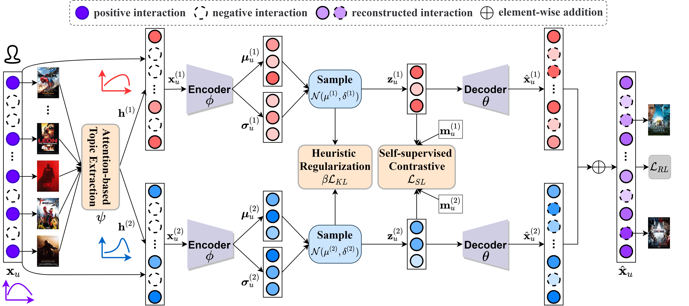

## TopicVAE
This is the Tensorflow  implementation for our ACM MM 2022 paper:
>Zhiqiang Guo, Guohui Li, Jianjun Li, Huaicong Chen. TopicVAE: Topic-aware Disentanglement Representation Learning for Enhanced Recommendation. In MM 2022. [Paper](#)

### Introduction
In this work, we propose a novel **Topic-aware Disentangled Variational AutoEncoder (TopicVAE)** to disentangle and infer representations of users and items from content information for enhanced recommendation. As shown in the framework, TopicVAE mainly contains four modules: attention-based topic extraction (ATE), topic-level variational autoencoder (TVAE), topic-guided contrastive loss(TCL) and heuristic regularization (HREG).



### Environment
pip install -r requirements.txt

### Data processing
We provide one processed dataset: Industrial. 
To process other amazon datasets, you first need to download [the json file with reviews](https://nijianmo.github.io/amazon/index.html) and the [word embedding vectors](https://dl.fbaipublicfiles.com/fasttext/vectors-english/wiki-news-300d-1M.vec.zip) generated by *FastText* model pre-trained on Wikipedia, and put them in the data folder.

Then you can run process_fasttext.py to get the final processed datasets.
```
python process_fasttext.py --data=data/Industrial.json
```
*NOTE*: other word vertor models can also be used to process the dataset, such as *Word2Vec*, *GloVe*. 
### Run
After processing the datasets, you can test TopicVAE/TopicDAE on Industrial dataset by:
```
python TopicVAE.py --data=data/fasttext/Industrial --mode=tst
python TopicDAE.py --data=data/fasttext/Industrial --mode=tst
```
or retrain TopicVAE/TopicDAE by:
```
python TopicVAE.py --data=data/fasttext/Industrial --mode=trn
python TopicDAE.py --data=data/fasttext/Industrial --mode=trn
```
You also can set different parameters to train this model.


